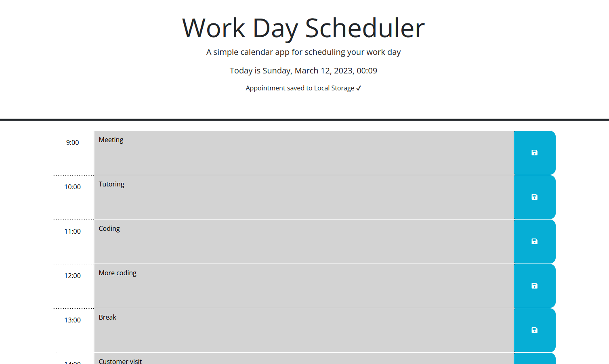

# <Daily-Planner>

## Description

This website provides a simple calendar app so an employee with a busy schedule can add important events to a daily planner so that they can manage time effectively.

The app shows the current date and hour on the top.
If the user scrolls down, they will be able to see and use timeblocks in 1-hour format showing standard business.
Each timeblock displays the hour, a text area to write down appointments, and a save button.
Each timeblock shows a different color, gray for past time, red for present, and green for future.
The save button will save the text area information into Local Storage.


Through the creation of this app, I learned how to use Dayjs and Local Storage to solve problems in an effective way.

## Table of Contents

- [Usage](#usage)
- [License](#license)


## Usage

To use this app, the user needs to follow the next simple steps:

* Choose the desired hour and write down the event in the text area.
* Press down the save button, when this is done, a message will display saying it was saved into Local Storage.
* When the user refreshes the site, the information will still be there.

    ```md
    
    ```

## License

MIT License

Copyright (c) [2023] [Angelina Huerta Cortés]

Permission is hereby granted, free of charge, to any person obtaining a copy
of this software and associated documentation files (the "Software"), to deal
in the Software without restriction, including without limitation the rights
to use, copy, modify, merge, publish, distribute, sublicense, and/or sell
copies of the Software, and to permit persons to whom the Software is
furnished to do so, subject to the following conditions:

The above copyright notice and this permission notice shall be included in all
copies or substantial portions of the Software.

THE SOFTWARE IS PROVIDED "AS IS", WITHOUT WARRANTY OF ANY KIND, EXPRESS OR
IMPLIED, INCLUDING BUT NOT LIMITED TO THE WARRANTIES OF MERCHANTABILITY,
FITNESS FOR A PARTICULAR PURPOSE AND NONINFRINGEMENT. IN NO EVENT SHALL THE
AUTHORS OR COPYRIGHT HOLDERS BE LIABLE FOR ANY CLAIM, DAMAGES OR OTHER
LIABILITY, WHETHER IN AN ACTION OF CONTRACT, TORT OR OTHERWISE, ARISING FROM,
OUT OF OR IN CONNECTION WITH THE SOFTWARE OR THE USE OR OTHER DEALINGS IN THE
SOFTWARE.

---
